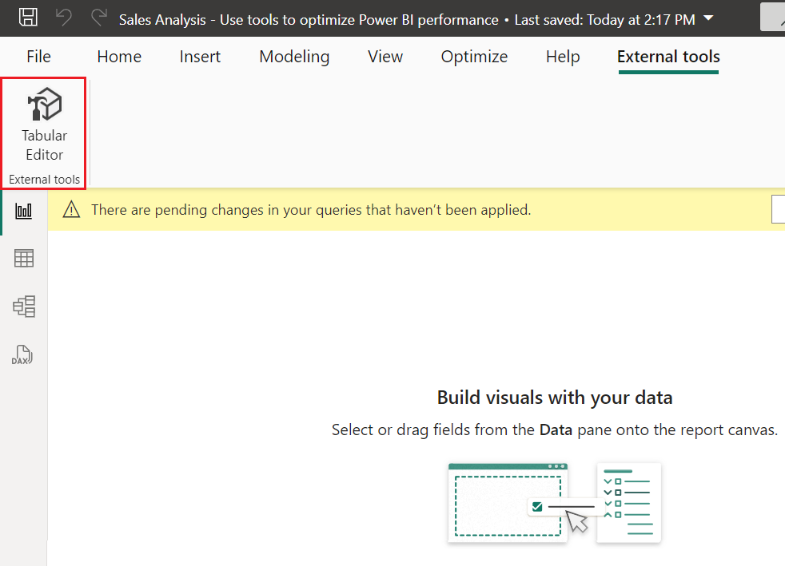
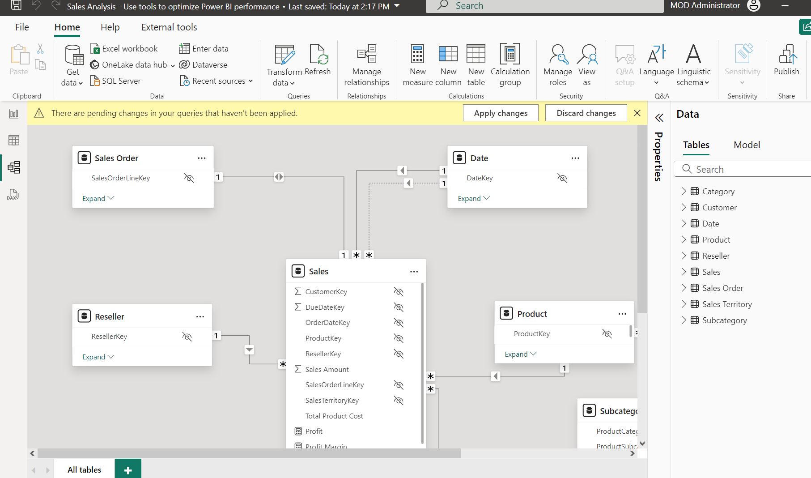
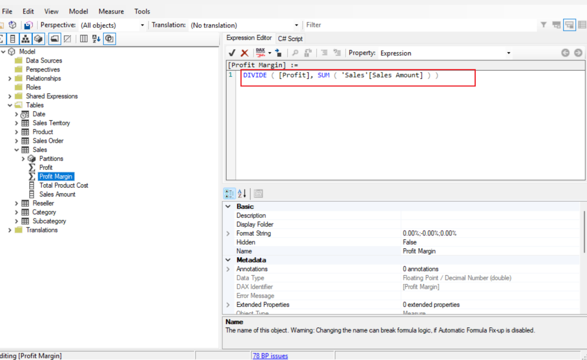
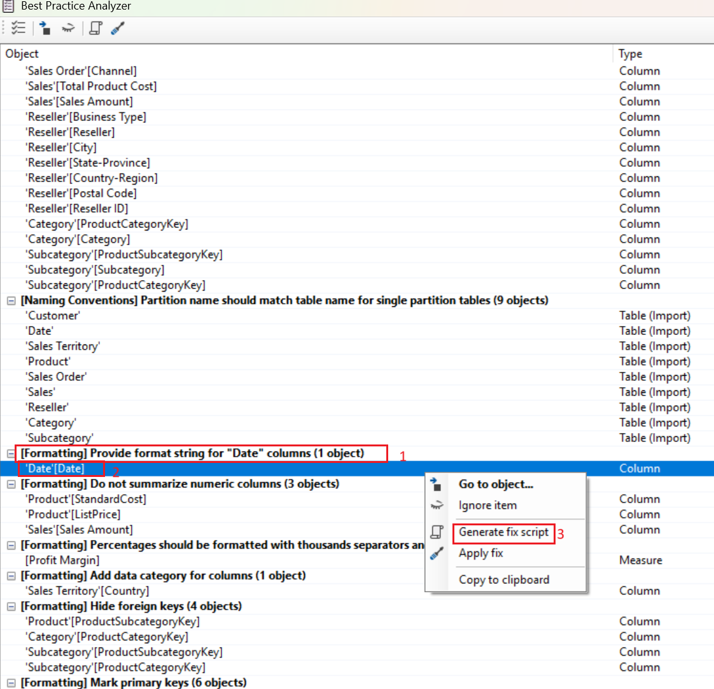

# Use case 03-Optimizing Power BI Performance with DAX Studio and Tabular Editor

**Introduction**

In today’s data-driven world, optimizing the performance of Power BI
reports is crucial for efficient data analysis and decision-making. This
lab focuses on using external tools to enhance the development,
management, and optimization of data models and DAX queries in Power BI.

**Objective**

The primary objective of this lab is to equip participants with the
skills to use two powerful tools: the Best Practice Analyzer (BPA) in
Tabular Editor and DAX Studio. By the end of this lab, participants will
be able to:

  - Analyze and optimize DAX queries.

  - Implement best practices for data model development.

  - Enhance the overall performance of Power BI reports.

# Task 1: Install Power BI Desktop

1.  Open your browser, navigate to the address bar, type or paste the
    following URL:
   +++https://www.microsoft.com/en-us/download/details.aspx?id=58494+++ then
    press the **Enter** button.

2.  In the **Microsoft Power BI Desktop** page, click on the
    **Download** button.

    

3.  Select **PBIDesktopSetup\_x64.exe** and then click on **Download**
    button.

    

4.  **PBIDesktopSetup_x64.exe** file will be downloaded. Click on the
    downloaded file to install the PowerBI desktop software. (In case,
    you did not find the **PBIDesktopSetup\_x64.exe** file on your
    window, then navigate to the **Downloads** folder of your system and
    continue the installation process).

   

5.  In the **Microsoft Power BI Desktop(x64) Setup** window, click on
    **Next**.

    
    
    

6.  On the Microsoft Software License Terms tab select the **I accept
    the terms in the License Agreement** and click on **Next** button

    

7.  Select the path and click on **Next** button

     

8.  On ready to install tab , click on Install button.

     

9.  Click on **Finish** button.

     

10. In the **Microsoft** window, enter assigned credentials, and click
    on the **Next** button.

      

11. Then, In the **Microsoft** window enter the password and click on
    the **Sign in** button

     

12. Close the Power BI Desktop

# Task 2:Install Tabular Editor 2

> *Tabular Editor is an alternative tool for authoring tabular models
> for Analysis Services and Power BI. Tabular Editor 2 is an open source
> project that can edit a BIM file without accessing any data in the
> model.*

1.  Open your browser, navigate to the address bar, type or paste the
    following URL:
    +++https://github.com/TabularEditor/TabularEditor/releases+++ then press
    the **Enter** button.

2.  Scroll down to the **Assets** section and select
    the **TabularEditor.Installer.msi** file. This will initiate the
    file install.

     

3.  Upon completion, select **Open file** to run the installer.

     

4.  In the Tabular Editor installer window, select **Next**.

     

5.  At the **License Agreement** step, if you agree, select **I agree**,
    and then select **Next**.

      

6.  At the **Select Installation Folder** step, select **Next**.

      

7.  At the **Application Shortcuts** step, select **Next**.

      

8.  At the **Confirm Installation** step, select **Next**.

9.  If prompted, select **Yes** to allow app to make changes.

    

10. When the installation is complete, select **Close**

     

Tabular Editor is now installed and registered as a Power BI Desktop
external tool.

# Task 3: Set up Power BI Desktop

In this task, you will open a pre-developed Power BI Desktop solution.

1.  Navigate to the **Sales Analysis starter file** and open it in Power
    BI Desktop.

2.  Browse to **C:\\LabFiles** on your VM, then select **Sales Analysis
    starter file** and click on **Open** button.

    

3.  Un the PowerBI desktop Select the **External Tools** ribbon tab.

    

4.  Notice that you can launch **Tabular Editor** from this ribbon tab.

*Note: Later in this exercise, you will use Tabular Editor to work with
BPA.*

    

# Task 4: Review the data model

In this task, you will review the data model.

1.  In Power BI Desktop, at the left, switch to **Model** view.

      

2.  Use the model diagram to review the model design.

    

*The model comprises eight dimension tables and one fact table.
The **Sales** fact table stores sales order details. It’s a classic
star schema design that includes snowflake dimension tables
(**Category> Subcategory >Product**) for the product
dimension.*

# Task 5: Load BPA rules

In this task, you will load BPA rules.

*The BPA rules aren’t added during the Tabular Editor installation. You
must download and install them.*

1.  On the **External Tools** ribbon, select **Tabular Editor**.

      

2.  Tabular Editor opens in a new window and connects live to the data
    model hosted in Power BI Desktop. Changes made to the model in
    Tabular Editor aren’t propagated to Power BI Desktop until you save
    them.

3.  To load the BPA rules, select the **C# Script** tab.

    *Note: This may be called the Advanced Scripting tab in older versions
    of Tabular Editor.*

      

4.  Paste in the following script. To run the script, on the toolbar,
    select the **Run script** command.
    ```
    System.Net.WebClient w = new System.Net.WebClient(); 
    
     string path = System.Environment.GetFolderPath(System.Environment.SpecialFolder.LocalApplicationData);
     string url = "https://raw.githubusercontent.com/microsoft/Analysis-Services/master/BestPracticeRules/BPARules.json";
     string downloadLoc = path+@"\TabularEditor\BPARules.json";
     w.DownloadFile(url, downloadLoc);
    ```

     

5.  To use the BPA rules, you must close and then reopen Tabular
    Editor.

6.  Close Tabular Editor.

     

7.  To reopen Tabular Editor, in Power BI Desktop, on the **External
    Tools** ribbon, select **Tabular Editor**.
    
    

# Task 6: Review the BPA rules

In this task, you will review the BPA rules that you loaded in the
previous task.

1.  In Tabular Editor, on the menu, select **Tools** \> **Manage BPA
    Rules**.

      

2.  In the **Manage Best Practice Rules** window, in the **Rule
    collections** list, select **Rules for the local user**.

      

3.  In the **Rules in collection** list, scroll down the list of rules.

*Tip: You can drag the bottom right corner to enlarge the window.*

 Within seconds, Tabular Editor can scan your entire model against each
of the rules and provides a report of all the model objects which
satisfy the condition in each rule. 

4.  Notice that BPA groups the rules into categories.

 Some rules, like DAX expressions, focus on performance optimization
while others, like the formatting rules, are aesthetic-oriented. 

5.  Notice the **Severity** column.

  The higher the number, the more important the rule. 

6.  Scroll to the bottom of the list, and then uncheck the **Set
    IsAvailableInMdx to false on non-attribute columns** rule.
    Select **OK**

    

*You can disable individual rules or entire categories of rules. BPA
won’t check disabled rules against your model. The removal of this
specific rule is to show you how to disable a rule.*

# Task 7: Address BPA issues

In this task, you will open BPA and review the results of the checks.

1.  On the Tabular Editor window, select **Tools** > **Best Practice
    Analyzer** (or press **F10**).

    

2.  In the **Best Practice Analyzer** window, if necessary, maximize the
    window.

3.  Notice the list of (possible) issues, grouped by category.

4.  In the first category, right-click the **‘Product’** table, and then
    select **Ignore item**.

    

*When an issue isn’t really an issue, you can ignore that item. You can
always reveal ignored items by using the **Show ignored** command on the
toolbar.*

5.  Further down the list, in the **Use the DIVIDE function for
    division** category, right-click **\[Profit Margin\]**, and then
    select **Go to object**.

      

6.  This command switches to Tabular Editor and focuses on the object.
    It makes it easy to apply a fix to the issue.

    

7.  In the Expression Editor, modify the DAX formula to use the more
    efficient (and safe) DIVIDE function, as follows.

codeCopy

   +++DIVIDE ( [Profit], SUM ( 'Sales'[Sales Amount] ) )+++
    

8.  To save the model changes, on the toolbar, select the **Save changes
    to the connected database** command (or press **Ctrl+S**).

    

    *Saving changes pushes modifications to the Power BI Desktop data
    model.*

9.  Switch back to the (out of focus) **Best Practice Analyzer** window.

      

10. Notice that BPA no longer lists the issue.

11. Scroll down the list of issues to locate the **Provide format string
    for “Date” columns** category.

12. Right-click the **‘Date’\[Date\]** issue, and then select **Generate
    fix script**.

     
  
   This command generates a C\# script and copies it to the clipboard.
   You can also use the **Apply fix** command to generate and run the
   script, however it might be safer to review (and modify) the script
   before you run it.

13. When notified that BPA has copied the fix script to the clipboard,
    select **OK**.

      

14. Switch to Tabular Editor, and select the **C# Script** tab.

   Note: This may be called the Advanced Scripting tab in older versions
  of Tabular editor. 
    

15. To paste the fix script, right-click inside the pane, and then
    press **Ctrl+V**.

*Note: You can choose to make a change to the format string.*

16. To run the script, on the toolbar, select the **Run
    script** command.

    

17. In the **Tabular Editor** page, open the **File** menu, and then
    click ‘**Save**.’
    
    

18. To close Tabular Editor, on the menu, select **File** \> **Exit**.

    

19. Switch back to **Power BI Desktop** and **save** the Power BI
    Desktop file.

      

*You must also save the Power BI Desktop file to ensure the Tabular
Editor changes are saved.*

20. In the message about pending changes, select **Apply later**.

    

# Task 8: Use DAX Studio

In this task, you’ll use DAX Studio to optimize DAX queries in the Power
BI report file.

*According to its website, DAX Studio is “the ultimate tool for
executing and analyzing DAX queries against Microsoft Tabular models.”
It’s a feature-rich tool for DAX authoring, diagnosis, performance
tuning, and analysis. Features include object browsing, integrated
tracing, query execution breakdowns with detailed statistics, DAX syntax
highlighting and formatting.*

1.  Open your browser, navigate to the address bar, type or paste the
    following URL: <https://daxstudio.org/downloads/> then press the
    **Enter** button.

2.  Select **DaxStudio_3_X_XX_setup.exe (installer)** - this will
    initiate the file install. 

     Note: The version of DAX studio will change slightly over time.
    Download the latest release.
 
     

3.  Upon completion, select **Open file** to run the installer.

     
    
4.  In the DAX Studio installer window, select **Install for all users
    (recommended)**.

     

5.  In the **User Account Control** window, select **Yes** to allow the
    app to make changes to the device.

6.  At the **License Agreement** step, if you accept the license terms,
    select **I accept the agreement**, and then select **Next**.

     

7.  Select **Next** to use the default destination location.

     

8.  Select **Next** to select the default components to install.

     

9.  Select **Next** to place the shortcut on the default start menu
    folder.

10. Select **Create a desktop shortcut** and select next.

      

11. Select **Install**.

      

12. Upon completion, with **Launch DAX Studio** selected,
    select **Finish**. This will open DAX Studio. 

     

13. In the **Connect** window, select the **Power BI / SSDT
    Model** option.

     

14. In the corresponding dropdown list, ensure the **Sales Analysis -
    Use tools to optimize Power BI performance** model is selected.
    Select **Connect**.

    

    Note: If you do not have the **Sales Analysis - Use tools to optimize
    Power BI performance** starter file open, you will not be able to
    connect. Be sure the file is open.

15. If necessary, maximize the DAX Studio window.

      

# Task 9: Use DAX studio to optimize a query

In this task, you will optimize a query by using an improved measure
formula.

*Note that it’s difficult to optimize a query when the data model
volumes are small. This exercise focuses on using DAX Studio rather than
optimizing DAX queries.*

1.  Switch to the Dax Studio window and from the **File** menu,
    select **Browse** to navigate to the **Monthly Profit
    Growth.dax** file and **Open** the file.

     
  
     

2.  Browse to **C:\\LabFiles** on your VM, then select **Monthly Profit
    Growth.dax** file .  and click on **Open** button.

     

*It’s not important to understand the query in its entirety.*

*The query defines two measures that determine monthly profit growth.
Currently, the query only uses the first measure (at line 72). When a
measure isn’t used, it doesn’t impact on the query execution.*

3.  To run a server trace to record detailed timing information for
    performance profiling, on the **Home** ribbon tab, from inside
    the **Traces** group, select **Server Timings**.

     

4.  To run the script, on the **Home** ribbon tab, from inside
    the **Query** group, select the **Run** icon.

      

5.  In the lower pane, review the query result.

      

    *The last column displays the measure results.*

6.  In the lower pane, select the **Server Timings** tab.
    
    

7.  Review the statistics available at the left side.


    From top left to bottom right, the statistics tell you how many
    milliseconds it took to run the query, and the duration the storage
    engine (SE) CPU took. In this case (your results will differ), the
    formula engine (FE) took 58.6% of the time, while the SE took the
    remaining 67.6% of the time. There were 34 individual SE queries and 23
    cache hits.

8.  Run the query again, and notice that all SE queries come from the SE
    cache.

    

     That’s because the results were cached for reuse. Sometimes in your
    testing, you may want to clear the cache. In that case, on
    the **Home** ribbon tab, by selecting the down arrow for
    the **Run** command 

    
    

     The second measure definition provides a more efficient result. You
    will now update the query to use the second measure. 

9.  At line 72, replace the word **Bad** with **Better**.Run the query,
    and then review the server timing statistics.

    

    

10. Run it a second time to result in full cache hits.

      

    *In this case, you can determine that the “better” query, which uses
    variables and a time intelligence function, performs better-almost a 50%
    reduction in query execution time.*

11. Close all applications - there’s no need to save the files.
Summary

This lab provides a practical guide to optimizing Power BI performance
using two essential tools: the Best Practice Analyzer (BPA) in Tabular
Editor and DAX Studio. you will learn to identify and resolve
performance issues in DAX queries, apply best practices for developing
efficient data models, and enhance the overall performance of Power BI
reports. The lab, designed to be completed in about 30 minutes, requires
access to a Microsoft Fabric trial and offers valuable hands-on
experience for improving data analysis and decision-making capabilities
in Power B
