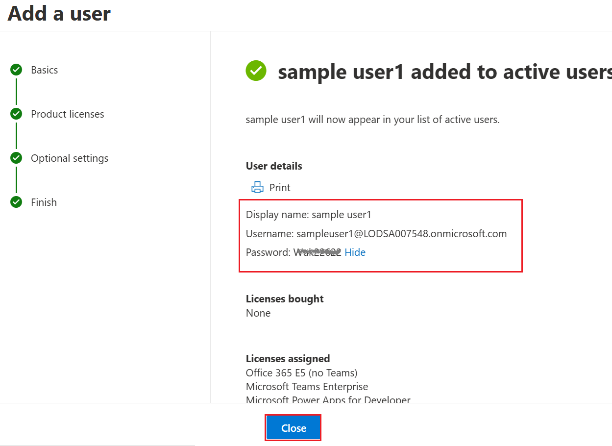
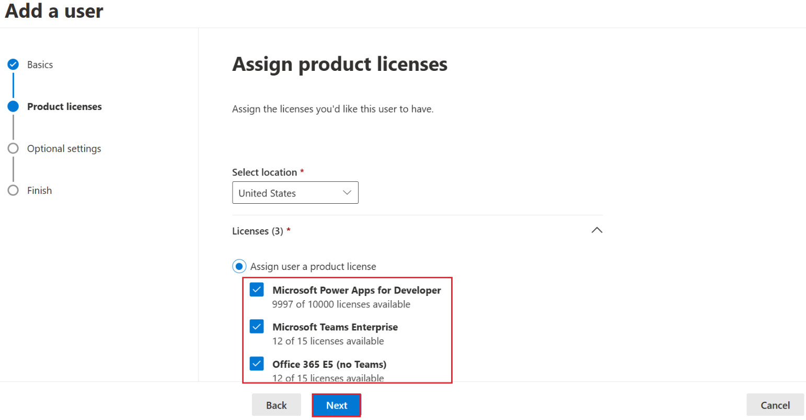
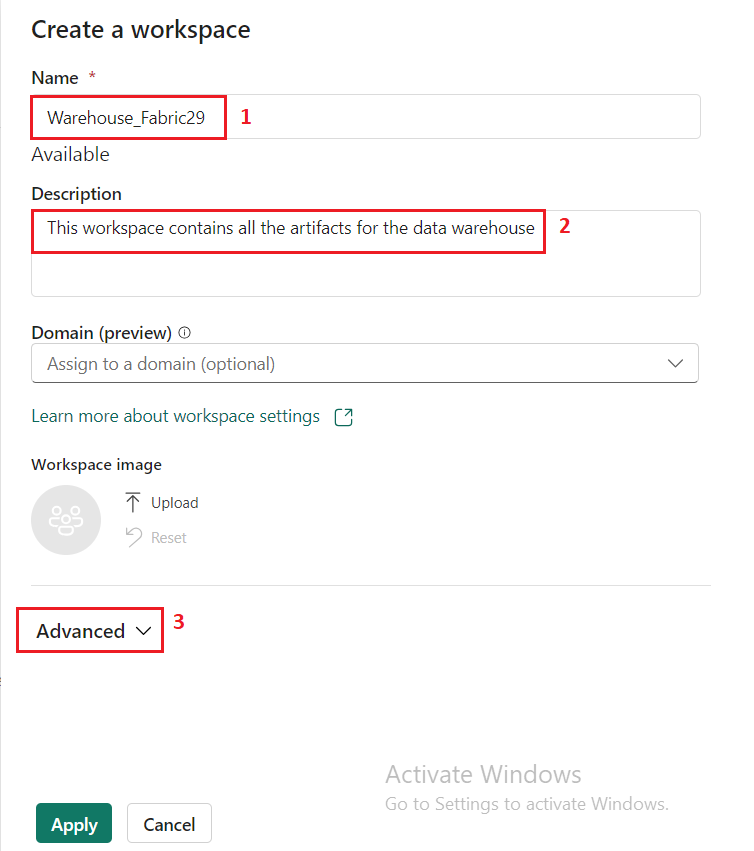
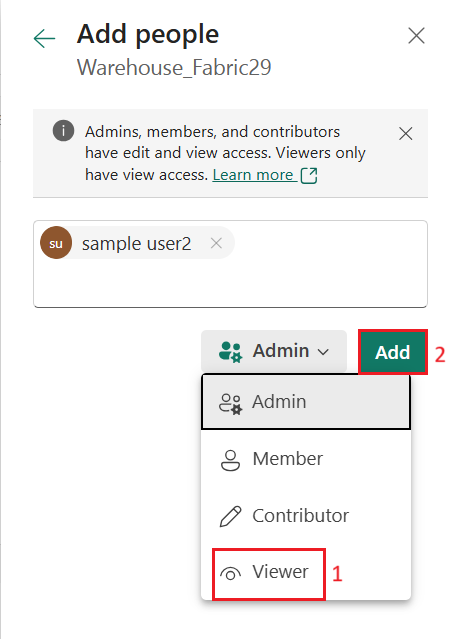
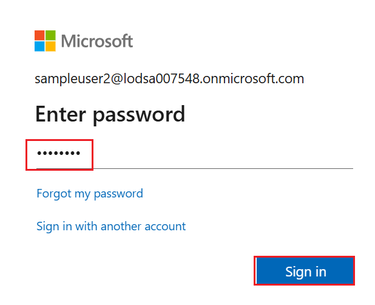
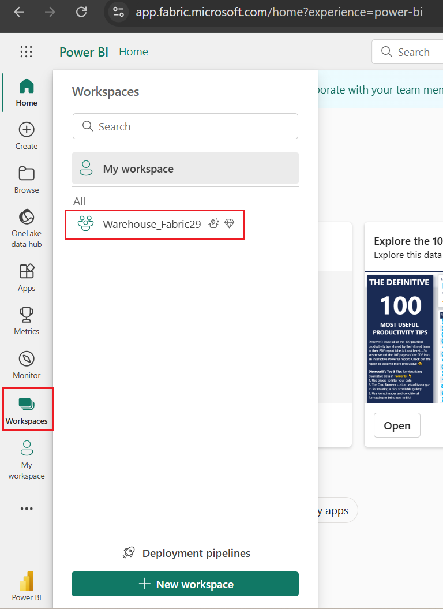
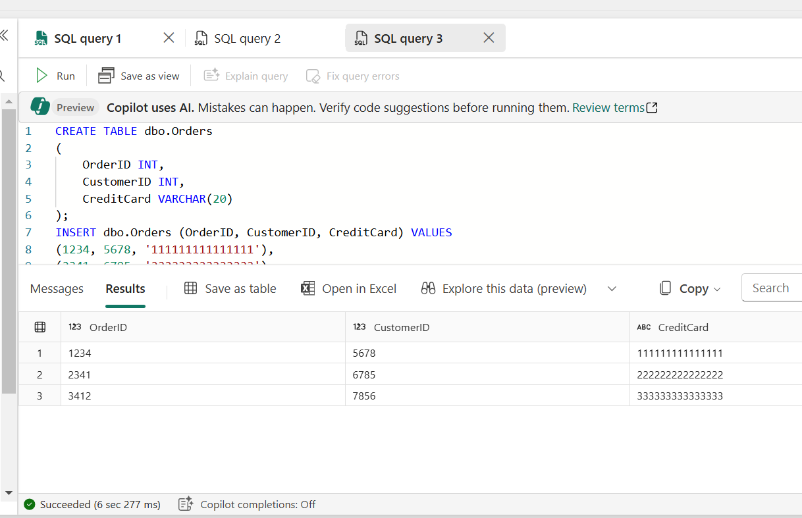

# Use Case 05-Securing a Microsoft Fabric data warehouse

**Introduction**

In today’s data-driven world, securing sensitive information is
paramount. Dynamic Data Masking (DDM) is a powerful feature in Microsoft
Fabric that helps protect confidential data by obfuscating it for
unauthorized users. This lab will guide you through the process of
applying DDM rules to columns in a table, ensuring that sensitive data
remains secure while still being accessible for legitimate purposes.

**Objective**

The objective of this usecase is to demonstrate how to implement Dynamic
Data Masking in a data warehouse environment using Microsoft Fabric. By
the end of this lab, you will be able to:

  - Understand the concept and benefits of Dynamic Data Masking.

  - Apply DDM rules to specific columns in a table.

  - Verify the effectiveness of the masking rules by querying the data
    as different users.

## Task 1:Add users and assign licenses at the same time

1.  Open a new tab on your browser and enter the following link in the
    address bar++https://go.microsoft.com/fwlink/p/?linkid=2024339+++

    

2.  On the Microsoft 365 admin center page, select **Add a user**

    

3.  In the **Add a user** tab, enter the user details and click on the
    **Next** button:

      - **First name:** sample
    
      - **Last name:**user1
    
      - **User name:**sampleuser1

      

4.  In the **Add a user** tab, under the **Assign product licenses**
    pane, select all licenses and click on the **Next** button.

      

5.  Click on the Next button.

      

6.  Review the user details and click on the **Finish adding** button.

    

7.  Copy the **Username** and **Password** and paste them on a notepad,
    as you need them in the upcoming task.

     

8.  Follow the previous steps to add another user and enter the user
    details.

     - **First name:** sample
  
    - **Last name:** user2
  
    - **User name:** sampleuser2

      
    
      
    
      

      

      

9.  Copy the **Username** and **Password** and paste them on a notepad,
    as you need them in the upcoming task.

      
 
     

## Task 2: Create a workspace

Before working with data in Fabric, create a workspace with the Fabric
trial enabled.

1.  Open your browser, navigate to the address bar, and type or paste
    the following URL: +++https://app.fabric.microsoft.com/+++ then press the
    **Enter** button.

     

2.  In the **Microsoft Fabric** window, enter assigned credentials, and
    click on the **Submit** button.

     

3.  Then, In the **Microsoft** window enter the password and click on
    the **Sign in** button**.**

     

4.  In **Stay signed in?** window, click on the **Yes** button.

     

5.  On the **Microsoft Fabric** home page, select the **Power BI**
    template.

     

6.  In the **Power BI Home** page menu bar on the left,
    select **Workspaces** (the icon looks similar to 🗇).

     

7.  In the Workspaces pane Select **+** **New workspace**.

     

8.  In the **Create a workspace tab**, enter the following details and
    click on the **Apply** button.

    |   | |
    |-----|-----|
    |Name	|+++Warehouse_FabricXX+++ (XX can be a unique number) (here, we entered Warehouse_Fabric29)|
    |Description|	This workspace contains all the artifacts for the data warehouse|
    |Advanced|	Under License mode, select Trial|
    |Default storage format|	Small dataset storage format|


     
    
     

     

9.  Wait for the deployment to complete. It takes 1-2minutes to
    complete. When your new workspace opens, it should be empty.

      

## Task3: Give users access to workspaces

1.  On the **Synapse Data Warehouse** home page, select **Mange access**

      

2.  In the **Manage access** tab, click on the **+Add people or groups**
    button
    

3.  In the **Add people** tab, enter the name or email of
    **sampleuser1**, select the **Admin** role, and then click **Add.**

      

4.  In the **Add people** tab, enter the name or email of
    **sampleuser2**, select the **Viewer** role, and then click **Add.**

     
  
     

## Task 4: Create a Warehouse in Microsoft Fabric

1.  In the **Power BI Warehouse_FabricXX** page, click on the **Data
    Warehouse** icon located at the bottom left and select **Data
    Warehouse** under Datascience.

      

2.  In the **Synapse** **Data Warehouse** page, select **Warehouse** to
    create a lakehouse.

     

3.  On the **New warehouse** dialog, enter +++**datawarehouse+++** and
    click on the **Create** button.

      

4.  After a minute or so, a new warehouse will be created:

    

## Task 5: Apply dynamic data masking rules to columns in a table

Dynamic data masking rules are applied on individual columns at the
table level so all queries are affected by the masking. Users who do not
have explicit permissions to view confidential data see masked values in
query results while users with explicit permission to view the data see
it unobscured. There are four types of masks: default, email, random and
custom string. In this exercise, you will apply a default mask, an email
mask, and a custom string mask.

1.  In your warehouse, select the **T-SQL** tile,

     

2.  Replace the default **SQL** code with the following T-SQL statements
    to create a table and to insert and view data.
      ```
      CREATE TABLE dbo.Customers
      (   
          CustomerID INT NOT NULL,   
          FirstName varchar(50) MASKED WITH (FUNCTION = 'partial(1,"XXXXXXX",0)') NULL,     
          LastName varchar(50) NOT NULL,     
          Phone varchar(20) MASKED WITH (FUNCTION = 'default()') NULL,     
          Email varchar(50) MASKED WITH (FUNCTION = 'email()') NULL   
      );
         
      INSERT dbo.Customers (CustomerID, FirstName, LastName, Phone, Email) VALUES
      (29485,'Catherine','Abel','555-555-5555','catherine0@adventure-works.com'),
      (29486,'Kim','Abercrombie','444-444-4444','kim2@adventure-works.com'),
      (29489,'Frances','Adams','333-333-3333','frances0@adventure-works.com');
         
      SELECT * FROM dbo.Customers;
      ```

3.  Use the **▷ Run** button to run the SQL script, which creates a new
    table named **Customers** in the **dbo** schema of the data
    warehouse.

     

    When users who are restricted from seeing unmasked data query the table,
    the **FirstName** column will show the first letter of the string with
    XXXXXXX and none of the last characters. The **Phone** column will show
    xxxx. The **Email** column will show the first letter of the email
    address followed by XXX@XXX.com. This approach ensures that sensitive
    data remains confidential, while still allowing restricted users to
    query the table.

      

4.  Then, in the **Explorer** pane,
    expand **Schemas** > **dbo** > **Tables** and verify that
    the **Customers** table has been created. The SELECT statement
    returns unmasked data for you because as the workspace creator,
    you’re a member of the Workspace Admin role which can see unmasked
    data.

    

5.  Connect as a test user that’s a member of the **Viewer** workspace
    role and run the following T-SQL statement.

    +++SELECT * FROM dbo.Customers;+++
      
 
      The test user hasn’t been granted UNMASK permission so data returned
     for the FirstName, Phone, and Email columns is masked because those
     columns were defined with a mask in the CREATE TABLE statement.

6.  Reconnect as yourself, the Workspace Admin, and run the following
    T-SQL to unmask data for the test user.
    Replace \<username\>@\<your\_domain\>.com with the name of the user
    you’re testing with who is a member of the **Viewer** workspace
    role(In this use case, we are assigning the Viewer role to **sample
    User2**)

   +++GRANT UNMASK ON dbo.Customers TO [<username>@<your_domain>.com];+++

7.  Use the **▷ Run** button to run the script.

    

8.  Open your browser, navigate to the address bar, and type or paste
    the following URL: **https://app.fabric.microsoft.com/** then press
    the **Enter** button.

      

9.  In the **Microsoft Fabric** window, enter **sample User2**
    credentials(which you have saved in Task 1), and click on the
    **Submit** button.

      

10. Then, In the **Microsoft** window enter the **sample User2**
    password and click on the **Sign in** button**.**

      

11. Then, in the **Update your password** window, update **sample
    User2’s** password and click on the **Sign in** button.
    
      
    
      

12. In the **Power BI Home** page menu bar on the left,
    select **Workspaces** and select **Warehouse_FabricXX**.

      

13. In the **Warehouse_FabricXX** page, select **datawarehouse**

    

14. Click on ***New SQL query*** dropdown in the command bar, then
    select **New SQL query** under **Blank** section. We'll start
    building our schema in the next step:

     

15.  Connect as the test user again and run the following T-SQL
    statement. Click on the **Run** button to execute the query. After
    the query is executed, you will see the results.

    +++SELECT * FROM dbo.Customers;+++
  

The data is returned unmasked because the test user has been granted
the UNMASK permission.

## Task 6: Apply row-level security

Row-level security (RLS) can be used to limit access to rows based on
the identity, or role of the user executing a query. In this exercise,
you restrict access to rows by creating a security policy and a security
predicate defined as an inline table-valued function.

1.  Return to the **admin** credentials browser.

2.  In the warehouse you created in the last task, select the **New SQL
    Query** dropdown. Under the header **Blank**, select **New SQL
    Query**.

     

3.  Create a table and insert data into it. So that you can test
    row-level security in a later step,
    replace username1@your\_domain.com with a user name from your
    environment and replace username2@your\_domain.com with your user
    name.
      ```
      CREATE TABLE dbo.Sales  
      (  
          OrderID INT,  
          SalesRep VARCHAR(60),  
          Product VARCHAR(10),  
          Quantity INT  
      );
          
      --Populate the table with 6 rows of data, showing 3 orders for each test user. 
      INSERT dbo.Sales (OrderID, SalesRep, Product, Quantity) VALUES
      (1, '<username1>@<your_domain>.com', 'Valve', 5),   
      (2, '<username1>@<your_domain>.com', 'Wheel', 2),   
      (3, '<username1>@<your_domain>.com', 'Valve', 4),  
      (4, '<username2>@<your_domain>.com', 'Bracket', 2),   
      (5, '<username2>@<your_domain>.com', 'Wheel', 5),   
      (6, '<username2>@<your_domain>.com', 'Seat', 5);  
          
      SELECT * FROM dbo.Sales;  
      ```

4.  Use the **▷ Run** button to run the SQL script, which creates a new
    table named **Sales** in the **dbo** schema of the data warehouse.

      
      
      

5.  Then, in the **Explorer** pane,
    expand **Schemas** > **dbo** > **Tables** and verify that
    the **Sales** table has been created.

      

6.  Create a new schema, a security predicate defined as a function, and
    a security policy.

7.  In the query editor, copy and paste the following code. Click on
    the **Run** button to execute the query. After the query is
    executed, you will see the results.
      ```
      --Create a separate schema to hold the row-level security objects (the predicate function and the security policy)
      CREATE SCHEMA rls;
      GO
         
      /*Create the security predicate defined as an inline table-valued function.
      A predicate evaluates to true (1) or false (0). This security predicate returns 1,
      meaning a row is accessible, when a row in the SalesRep column is the same as the user
      executing the query.*/   
      --Create a function to evaluate who is querying the table
      CREATE FUNCTION rls.fn_securitypredicate(@SalesRep AS VARCHAR(60)) 
          RETURNS TABLE  
      WITH SCHEMABINDING  
      AS  
          RETURN SELECT 1 AS fn_securitypredicate_result   
      WHERE @SalesRep = USER_NAME();
      GO   
      /*Create a security policy to invoke and enforce the function each time a query is run on the Sales table.
      The security policy has a filter predicate that silently filters the rows available to 
      read operations (SELECT, UPDATE, and DELETE). */
      CREATE SECURITY POLICY SalesFilter  
      ADD FILTER PREDICATE rls.fn_securitypredicate(SalesRep)   
      ON dbo.Sales  
      WITH (STATE = ON);
      GO
      ```
     

8.  Then, in the **Explorer** pane,
    expand **Schemas** > **rls** > **Functions**, and verify that
    the function has been created.

      

9.  Open your browser, navigate to the address bar, and type or paste
    the following URL: **https://app.fabric.microsoft.com/** then press
    the **Enter** button.

       

10. In the **Microsoft Fabric** window, enter **sample User1**
    credentials(which you have saved in Task 1), and click on the
    **Submit** button.

     

11. Then, In the **Microsoft** window enter the **sample User1**
    password and click on the **Sign in** button**.**

     

12. Then, in the **Update your password** window, update **sample
    User1’s** password and click on the **Sign in** button.

     

13. In the **Power BI Home** page menu bar on the left,
    select **Workspaces** and select **Warehouse\_FabricXX**.

     

14. In the **Warehouse\_FabricXX** page, select **datawarehouse**

     

15. Click on ***New SQL query*** dropdown in the command bar, then
    select **New SQL query** under **Blank** section. We'll start
    building our schema in the next step:

     

16. Log in to Fabric as the user you
    replaced <username1>@<your_domain>.com with, in the Sales
    table INSERTstatement. Confirm that you’re logged in as that user by
    running the following T-SQL.

      +++SELECT USER_NAME();+++

    

10. Query the **Sales** table to confirm that row-level security works
    as expected. You should only see data that meets the conditions in
    the security predicate defined for the user you’re logged in as.

    +++SELECT * FROM dbo.Sales;+++
    

## Task 7: Implement column-level security

Column-level security allows you to designate which users can access
specific columns in a table. It’s implemented by issuing
a GRANT or DENY statement on a table specifying a list of columns
and the user or role that can or cannot read them. To streamline access
management, assign permissions to roles in lieu of individual users. In
this exercise, you will create a table, grant access to a subset of
columns on the table, and test that restricted columns aren’t viewable
by a user other than yourself.

1.  Return to the **admin** credentials browser.

2.  In the warehouse you created in the earlier exercise, select
    the **New SQL Query** dropdown. Under the header **Blank**,
    select **New SQL Query**.

      

3.  Create a table and insert data into the table. In the query editor,
    copy and paste the following code. Click on the **Run** button to
    execute the query. After the query is executed, you will see the
    results.
      ```
      CREATE TABLE dbo.Orders
      (   
          OrderID INT,   
          CustomerID INT,  
          CreditCard VARCHAR(20)      
      );   
      INSERT dbo.Orders (OrderID, CustomerID, CreditCard) VALUES
      (1234, 5678, '111111111111111'),
      (2341, 6785, '222222222222222'),
      (3412, 7856, '333333333333333');   
      SELECT * FROM dbo.Orders;
      ```
      
      
      

4.  Deny permission to view a column in the table. The T-SQL statement
    prevents \<username\>@\<your\_domain\>.com from seeing the
    CreditCard column in the Orders table. In the DENY statement,
    replace \<username\>@\<your\_domain\>.com with a user name in your
    system who has **Viewer** permissions on the workspace.

5.  Click on the **Run** button to execute the query

     +++DENY SELECT ON dbo.Orders (CreditCard) TO [<username>@<your_domain>.com];+++
     

6.  Test column-level security by logging in to Fabric as the user you
    denied select permissions to.

7.  Return to the **sample user2** credentials browser.

8.  Query the Orders table to confirm that column-level security works
    as expected. The following query will return only the OrderID and
    CustomerID columns, not the CreditCard column.

9.  In the query editor, copy and paste the following code. Click on
    the **Run** button to execute the query. After the query is
    executed, you will see the results.

    +++SELECT * FROM dbo.Orders;+++

    

    You’ll receive an **error** because access to the CreditCard column has
    been restricted.

10. Try selecting only the OrderID and CustomerID fields and the query
    will succeed.

11. In the query editor, copy and paste the following code. Click on
    the **Run** button to execute the query. After the query is
    executed, you will see the results.

    +++SELECT OrderID, CustomerID from dbo.Orders+++

    

## Task 8: Configure SQL granular permissions using T-SQL

Fabric has a permissions model that allows you to control access to data
at the workspace level, and at the item level. When you need more
granular control of what users can do with securables in a Fabric
warehouse, you can use the standard SQL data control language (DCL)
commands GRANT,DENY and, REVOKE. In this exercise, you will create
objects, secure them using GRANT, and DENY, and then run queries to view
the effect of applying granular permissions.

1.  Return to the **admin** credentials browser.

2.  In the warehouse you created in the earlier exercise, select
    the **New SQL Query** dropdown. Under the header **Blank**,
    select **New SQL Query**.

      

3.  Create a stored procedure and a table. Then execute the procedure
    and query the table.

4.  In the query editor, copy and paste the following code. Click on
    the **Run** button to execute the query. After the query is
    executed, you will see the results.
      ```
      CREATE PROCEDURE dbo.sp_PrintMessage
      AS
      PRINT 'Hello World.';
      GO   
      CREATE TABLE dbo.Parts
      (
          PartID INT,
          PartName VARCHAR(25)
      );
         
      INSERT dbo.Parts (PartID, PartName) VALUES
      (1234, 'Wheel'),
      (5678, 'Seat');
       GO
         
      /*Execute the stored procedure and select from the table and note the results you get
      as a member of the Workspace Admin role. Look for output from the stored procedure on 
      the 'Messages' tab.*/
      EXEC dbo.sp_PrintMessage;
      GO   
      SELECT * FROM dbo.Parts
      ```

      

      

5.  Next DENY SELECT permissions on the table to a user who is a member
    of the **Workspace Viewer** role and GRANT EXECUTE on the procedure
    to the same user. Replace \<username\>@\<your\_domain\>.com with a
    user name from your environment that is a member of the **Workspace
    Viewer** role.
    ```
    DENY SELECT on dbo.Parts to [<username>@<your_domain>.com];
    
    GRANT EXECUTE on dbo.sp_PrintMessage to [<username>@<your_domain>.com];
    ```

      

6.  Return to the **sample user2** credentials browser.

7.  Sign in to Fabric as the user you specified in
    the **DENY** and **GRANT** statements in place
    of <username>@<your_domain>.com. Then test the granular
    permissions you applied by executing the stored procedure and
    querying the table.
      ```
      EXEC dbo.sp_PrintMessage;
      GO
         
      SELECT * FROM dbo.Parts;
      ```

    
    
    

## Task 9: Clean up resources

In this exercise, you applied dynamic data masking rules to columns in a
table, applied row-level security, implemented column-level security
and, configured SQL granular permissions using T-SQL.

1.  In the left navigation bar, select the icon for your workspace to
    view all of the items it contains.

      

2.  In the menu on the top toolbar, select **Workspace settings**.

    

3.  In the **General** section, select **Remove this workspace**.

    

**Summary**

In this usecase, you learned how to enhance data security in a data
warehouse by applying Dynamic Data Masking rules to columns in a table.
This feature allows you to control access to sensitive information,
ensuring that only authorized users can view the actual data while
others see masked values. By implementing DDM, you can protect sensitive
data from unauthorized access, thereby maintaining data privacy and
compliance with regulatory requirements.
